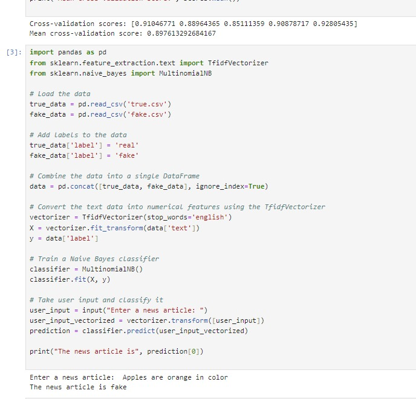

# Fake News Detection System

This repository contains a machine learning project aimed at detecting fake news. This is my first ML-based project, where I've implemented a model to classify news articles as either real or fake.



## Datasets

The datasets used for this project can be downloaded from [Kaggle](https://www.kaggle.com/datasets/clmentbisaillon/fake-and-real-news-dataset). The dataset consists of two files:
- `True.csv`: Contains news articles labeled as real.
- `Fake.csv`: Contains news articles labeled as fake.

## Working of the Model

### 1. Importing Libraries
We begin by importing all the necessary libraries required for data processing, model training, and evaluation.

### 2. Data Preparation
- **Merging Datasets**: The `True.csv` and `Fake.csv` datasets are merged into a single dataset.
- **Shuffling**: The merged dataset is shuffled to ensure randomness.
- **Labeling**: A new column called `label` is added to the dataset, where `1` indicates a real article and `0` indicates a fake article.
- **Concatenation**: The two datasets are concatenated into one `DataFrame` called `data`.

### 3. Text Vectorization
We use `TfidfVectorizer()` to convert the text data into numerical features. This helps in processing the textual data so that it can be used for training the model.

### 4. Splitting the Data
The dataset is split into training and testing sets using `train_test_split()`, with 80% of the data used for training and 20% used for testing.

### 5. Model Training
We use a **Naive Bayes classifier** on the training data. The Naive Bayes model is a simple yet effective algorithm for text classification.

### 6. Prediction
Once the model is trained, predictions are made on the test data using the `predict()` method. The model's performance is then evaluated using common metrics like accuracy, precision, and recall.

## How to Run

1. Clone the repository:
    ```bash
    git clone https://github.com/yourusername/Fake-News-Detection.git
    cd Fake-News-Detection
    ```

2. Download the datasets from [Kaggle](https://www.kaggle.com/datasets/clmentbisaillon/fake-and-real-news-dataset) and place them in the project directory.

3. Open the Jupyter Notebook:
    ```bash
    jupyter notebook Fakenewsdetection.ipynb
    ```
4. Run the cells in the notebook to execute the code and see the results.

## Results

The model performs well in detecting fake news, with an accuracy of around 93.66% on the test set. Detailed metrics and confusion matrix can be found in the results section of the code.

## Contributing

Feel free to fork this repository and submit pull requests. Any suggestions or improvements are welcome!


